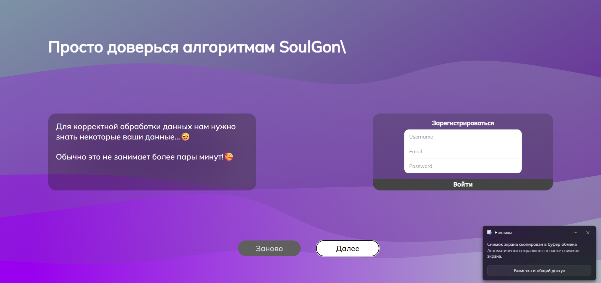
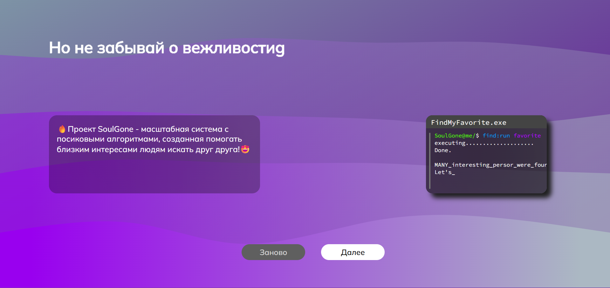
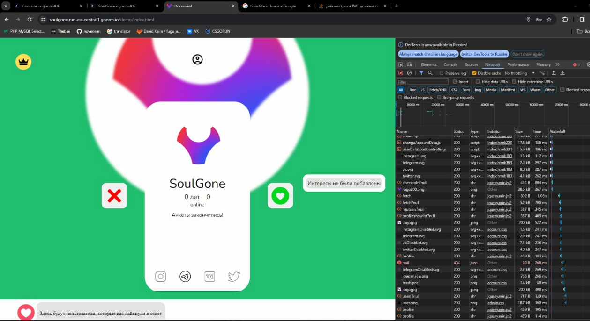
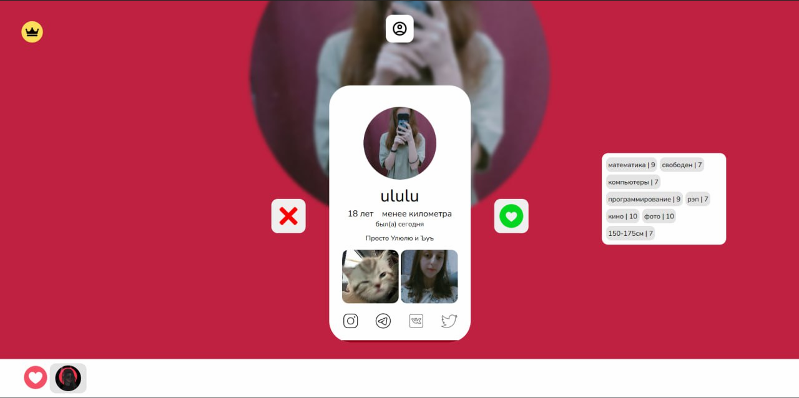

# 💘 SoulGone — Сайт знакомств на HTML + Spring Framework

SoulGone — это современный веб-сайт для знакомств, разработанный с использованием Java Spring Framework на серверной части и HTML/CSS/JavaScript на клиентской. Проект ориентирован на простоту, безопасность и удобство общения между пользователями.

## 🌐 Особенности

- 🔐 Регистрация и авторизация пользователей
- 🧑‍🤝‍🧑 Просмотр профилей и поиск по интересам
- 💬 Отправка сообщений и взаимодействие между участниками
- 📸 Загрузка аватаров и изображений
- 🧠 Алгоритм подбора по совместимости (в разработке)
- ⚙️ Панель администратора (модерация, управление пользователями)

## 🛠️ Технологии

**Frontend:**

- HTML5
- CSS3 (адаптивная верстка)
- JavaScript (валидация форм, динамика интерфейса)

**Backend:**

- Java 17+
- Spring Boot
- Spring Security
- Spring Data JPA
- PostgreSQL / H2
- REST API
  
### Превью регистрации

### Регистрация

### Гравная

### Профиль

